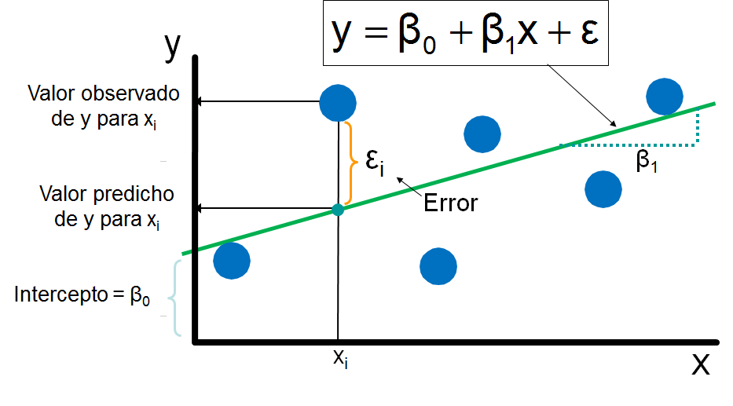
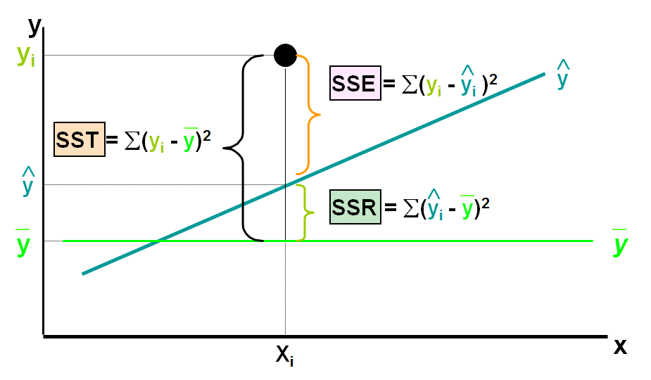

## Introducción 

Técnica que permite estimar, proyectar o describir el comportamiento de una variable _dependiente cuantitativa_ en función de otras independientes, _generalmente también cuantitativas_, que se presume inciden o modifican el comportamiento de esta. Y puede ser modelada como una línea recta. 

<span style="display:block; height: 0.8 cm;"></span>


\[ y = \beta_o + \beta_1  + \epsilon \]

<span style="display:block; height: 1.5 cm;"></span>

```{r, echo=FALSE,fig.align='center',out.width = "700px"}
      knitr::include_graphics('assets/img/rg.png')
```

---

## ¿Para qué usarla? 


<span style="display:block; height: 1 cm;"></span>

Hay tres usos principales en ciencias biológicas: 

+  Probar hipótesis de relaciones causa y efecto. 
+  Probar hipótesis de asociación entre las variables, pero, sin inferir necesariamente relación causa - efecto.
+ Predecir: Estimar el valor de una variable correspondiente a un valor particular de la otra. 

---

## Modelo de regresión 

Se denomina modelo de regresión, a la ecuación que describe cómo _y_ está relacionada con _x_ y el término de error.

\[\underbrace{y}_{\text{VD}}=\underbrace{\beta_o + \beta_1x}_{\text{Componente lineal}} + \underbrace{\epsilon}_{Error aleatorio}\]

- $\beta_0$ y $\beta_1$ son llamados parámetros del modelo.

- $\epsilon$ término de error. 	

---

## Modelo de regresión 

<span style="display:block; height: 1.5 cm;"></span>

```{r, echo=FALSE,fig.align='center',out.width = "700px"}
      
```

---
	

## Modelo de regresión 

<span style="display:block; height: 1 cm;"></span>

  \[\widehat{y}=\widehat{\beta}_o + \widehat{\beta}_1x + \epsilon\]
		
		
### Interpretación 

+  $\widehat{\beta}_1$: Cuánto se espera que cambie la variable dependiente (respuesta) por unidad de cambio en Xi.
+ $\widehat{\beta}_o$: Intercepto con y. 
+ ${\widehat{y}}$: es el valor estimado de y dado un valor de x.

---

## Explicando las variaciones....

<span style="display:block; height: 0.5 cm;"></span>

\[\underbrace{SST}_{\sum{(y-\bar{y})^2}}=\underbrace{SSR}_{\sum{(\widehat{y}-\bar{y})^2}}+ \underbrace{SSE}_{\sum{(y-\widehat{y})^2}}\]

```{r, echo=FALSE,fig.align='center',out.width = "800px"}
      
```


---


## Coeficiente de determinación $R^2$

<span style="display:block; height: 1.5 cm;"></span>

El Coeficiente de determinación ($R^2$) es la proporción de la variación total en la variable dependiente, que es explicada por la variación la variable independiente. 

\[R^2=\frac{SSR}{SST}\]

Donde, 

\[0 \leq R^2 \leq 1\]

---

## Coeficiente de correlación

<span style="display:block; height: 0.5 cm;"></span>

\[r=(\text{signo de} \beta_1) \sqrt{R^2}\]

Donde, 

\[-1 \leq r \leq 1\]

--- 

## Supuestos 

1. El error ($\epsilon$) es una variable aleatoria con media cero.
2. La varianza de $\epsilon$, $\sigma^2$, es la misma para todos los valores de x.
3. Los valores de  $\epsilon$ son independientes. 
4. El error $\epsilon$ está normalmente distribuido. 


---


## Supuestos 

```{r, echo=FALSE,fig.align='center',out.width = "800px"}
      knitr::include_graphics('assets/img/s1.png')
```


--- 


## Supuestos 

```{r, echo=FALSE,fig.align='center',out.width = "800px"}
      knitr::include_graphics('assets/img/s2.png')
```


--- 

## Supuestos 

```{r, echo=FALSE,fig.align='center',out.width = "800px"}
      knitr::include_graphics('assets/img/s3.png')
```


--- 

## Inferencia basadas en $\beta_1$ 

Para poner a prueba la significancia de la relación entre _x_ y _y_, 
sometemos a evaluación la hipótesis nula $\beta_1=0$.


### Hipótesis 
	
	
\[H_0: \beta_1=0\] 
	
\[H_a: \beta_1 \neq 0\]
			
Comúnmente se usa:
	
	
+ Intervalos de confianza

+ Valores P

---


## Veamos un ejemplo.. Ajuste del modelo de regresión

```{r include=FALSE}
require(car)
require(lmtest)
attach(faithful)
```


```{r}
modelo<-lm(eruptions ~ waiting, data=faithful)

```

---


## Veamos un ejemplo.. Ajuste del modelo de regresión

```{r}
summary(modelo)

```

---

## Gráficamos 

```{r, fig.align='center'}
plot( waiting,eruptions,
xlab='Waiting',ylab='Eruptions',col='blue',pch=1)
abline(modelo,col='red')
```


---

## Validación

### Normalidad

```{r}
shapiro.test(modelo$residuals)
```


---

## Validación  


### Homocedasticidad

```{r}
hmctest(modelo)

```


---

## Validación  


### Independencia

```{r}
dwtest(eruptions~waiting)

```


---
